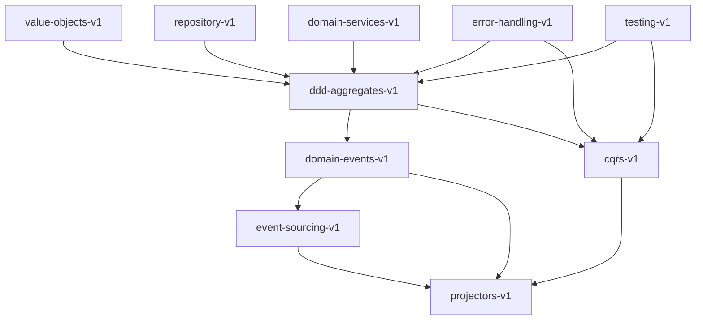

# Claude Code Governance Framework - Roadmap

## 🎯 Vision

Transform the framework from pattern-by-pattern evaluation into an intelligent orchestration system that understands pattern relationships, guides implementation sequences, and detects cross-pattern issues.

---

## 📊 Current State (Phase 1: Foundation)

**Completed:**
- ✅ 12 architecture patterns with YAML definitions
- ✅ Strategy-driven pattern framework (goal → guiding policy → tactics → constraints)
- ✅ LLM-as-judge evaluation with calibration rubrics
- ✅ Non-applicable tactic handling (-1 scoring)
- ✅ Implementation plan context support
- ✅ Pattern validation scripts for DDD, CQRS, Value Objects, Projectors
- ✅ Basic evaluation framework with deterministic + LLM checks

**Current Limitations:**
- Patterns evaluated independently (no cross-pattern awareness)
- No guidance on which patterns work well together
- No detection of pattern conflicts or missing dependencies
- Manual selection of pattern combinations
- No phase-aware evaluation (penalizes incomplete multi-pattern implementations)

---

## 🚀 Evolution Path

## Phase 2: Multi-Pattern Orchestration (Next Priority)

**Goal:** Enable intelligent pattern combination, dependency resolution, and cross-pattern evaluation.

### 2.1 Pattern Dependency System (2 weeks)

**Deliverables:**
- `patterns/meta/orchestration-rules.yaml` - Pattern dependency definitions
- `patterns/meta/cross-pattern-weights.yaml` - Weight adjustments for pattern combinations
- `evaluation/src/orchestration/pattern-dependency-graph.ts` - Dependency resolution engine
- `evaluation/src/orchestration/conflict-detector.ts` - Pattern conflict detection

**Key Features:**
```yaml
# Example: orchestration-rules.yaml
pattern_dependencies:
  cqrs-v1:
    requires: [ddd-aggregates-v1]
    recommends: [domain-events-v1]
    conflicts_with: [crud-style-v1]

  projectors-v1:
    requires: [domain-events-v1, cqrs-v1]
    recommends: [event-sourcing-v1]
```

**Acceptance Criteria:**
- Define dependencies for all 12 patterns
- Resolve transitive dependencies automatically
- Detect and report pattern conflicts
- Suggest complementary patterns

### 2.2 Cross-Pattern Evaluation (3 weeks)

**Deliverables:**
- `patterns/meta/integration-checks.yaml` - Cross-pattern validation rules
- `evaluation/src/orchestration/cross-pattern-scorer.ts` - Integration scoring
- Enhanced `evaluator.ts` with orchestration mode
- Integration test suite for pattern combinations

**Key Features:**
```typescript
// Evaluate pattern interactions
interface OrchestrationResult {
  individual_scores: Record<string, number>
  integration_scores: {
    "cqrs-aggregate-integration": {
      score: number,
      checks: string[]
    }
  }
  orchestration_score: number
  missing_patterns: string[]
}
```

**Integration Checks:**
1. **CQRS + DDD Aggregates**
   - Command handlers load/save aggregates (not direct DB access)
   - Query handlers bypass aggregates (read from projections)
   - Commands return IDs only, queries return DTOs

2. **Event Sourcing + Domain Events + Projectors**
   - All domain events have registered handlers
   - All events have at least one projector (or explicit opt-out)
   - Projectors subscribe to correct event types

3. **Domain Services + Aggregates**
   - Services coordinate multiple aggregates
   - Services don't contain business logic (orchestration only)
   - Services use repository pattern for persistence

**Acceptance Criteria:**
- 5+ integration check definitions
- Cross-pattern scoring algorithm implemented
- Detect common anti-patterns (query handlers loading aggregates, etc.)
- Integration scores contribute to overall pattern compliance

### 2.3 Implementation Sequencing (2 weeks)

**Deliverables:**
- `evaluation/src/orchestration/plan-generator.ts` - Phase-based plan generation
- Phase-aware evaluation (don't penalize incomplete phases)
- CLI command: `npm run orchestrate -- --feature="user management"`

**Key Features:**
```typescript
// Generate implementation plan with phases
interface OrchestrationPlan {
  patterns: Array<{
    name: string,
    phase: number,
    reason: string
  }>,
  phases: Array<{
    phase: number,
    title: string,
    patterns: string[],
    steps: string[],
    acceptance: string
  }>,
  warnings: string[]
}
```

**Example Output:**
```bash
$ npm run orchestrate -- --feature="order management with inventory"

Recommended Pattern Combination:
  Phase 1: Domain Model
    - ddd-aggregates-v1 (Order, Inventory)
    - domain-events-v1 (OrderCreated, InventoryReserved)

  Phase 2: Event Sourcing
    - event-sourcing-v1 (audit trail)

  Phase 3: Command Layer
    - cqrs-v1 (CreateOrderCommandHandler)
    - domain-services-v1 (InventoryService)

  Phase 4: Query Layer
    - projectors-v1 (OrderStatusProjector)
    - cqrs-v1 queries (GetOrderByIdQueryHandler)

⚠️  Warnings:
  - High concurrency requires optimistic locking
  - Consider saga pattern for multi-aggregate transactions
```

**Acceptance Criteria:**
- Generate phased implementation plans
- Phase-aware evaluation (score based on current phase only)
- Suggest next steps after each phase completion
- CLI integration with interactive mode

### 2.4 Pattern Gap Detection (1 week)

**Deliverables:**
- `evaluation/src/orchestration/gap-analyzer.ts` - Codebase pattern scanner
- CLI command: `npm run pattern-gaps [directory]`
- Pattern usage report generator

**Key Features:**
```bash
$ npm run pattern-gaps ./src

Analyzing codebase for pattern usage...

Found patterns:
  ✅ DDD Aggregates (15 files)
      src/domain/user/User.aggregate.ts
      src/domain/order/Order.aggregate.ts
      ...

  ✅ Domain Events (8 events)
  ✅ CQRS Commands (12 handlers)
  ⚠️  CQRS Queries (0 handlers) - Missing query side!
  ❌ Projectors (0 found) - You have events but no projectors

Pattern Gaps Detected:
  1. Add query handlers for read operations
  2. Create projectors for: UserCreated, OrderCreated, InventoryReserved
  3. Consider event-sourcing-v1 for Order aggregate (audit requirement)

Recommendations:
  - Run: npm run orchestrate -- --feature="read models" --existing-patterns=cqrs-v1,domain-events-v1
```

**Acceptance Criteria:**
- Scan codebase for pattern usage (AST analysis)
- Detect orphan events (events without projectors)
- Identify missing query/command sides
- Suggest complementary patterns

---

## Phase 3: Benchmarking & CI/CD Integration (High ROI)

**Timeline:** 3 weeks (can run parallel to Phase 2)

### 3.1 Benchmark Suite (2 weeks)

**Deliverables:**
- `benchmarks/ddd-aggregates/` - 5 standard tasks
- `benchmarks/cqrs/` - 5 standard tasks
- `benchmarks/orchestration/` - 3 multi-pattern tasks
- Automated benchmark runner

**Standard Tasks:**
```
benchmarks/
  ├── ddd-aggregates/
  │   ├── task-1-simple-aggregate.md        # User with basic fields
  │   ├── task-2-aggregate-with-entities.md # Order with LineItems
  │   ├── task-3-complex-invariants.md      # Account with balance rules
  │   ├── expected-scores/
  │   │   ├── task-1-baseline.json          # Score: 4.8
  │   │   └── task-1-regression.json        # Score: 2.5
  │   └── fixtures/
  │       ├── task-1-good-impl.ts
  │       └── task-1-bad-impl.ts
  │
  ├── orchestration/
  │   ├── task-1-ddd-cqrs-integration.md
  │   └── task-2-full-feature-stack.md      # Aggregate + Events + CQRS + Projector
```

**Acceptance Criteria:**
- 30+ benchmark tasks across all patterns
- Baseline scores established
- Regression detection (score drops > 0.5)
- Performance benchmarks (evaluation speed)

### 3.2 CI/CD Integration (1 week)

**Deliverables:**
- Pre-commit hooks for pattern validation
- GitHub Actions workflow
- PR quality gates
- Score regression detection

**Files:**
```yaml
# .github/workflows/pattern-validation.yml
name: Pattern Validation

on: [pull_request]

jobs:
  validate:
    runs-on: ubuntu-latest
    steps:
      - uses: actions/checkout@v3
      - run: npm install
      - run: npm run validate:all

      - name: Evaluate PR Changes
        run: |
          npm run evaluate:pr-changes -- \
            --base=${{ github.base_ref }} \
            --head=${{ github.sha }}

      - name: Quality Gate
        run: |
          if [[ $SCORE < 4.0 ]]; then
            echo "❌ Pattern score below threshold"
            exit 1
          fi
```

**Pre-commit Hook:**
```bash
# .husky/pre-commit
npm run validate:staged-files
```

**Acceptance Criteria:**
- Pre-commit validation prevents bad commits
- PR checks fail if pattern score < 4.0
- Detailed pattern compliance report in PR comments
- Benchmark regression detection in CI

---

## Phase 4: Custom Agents (High DX Impact)

**Timeline:** 3-4 weeks

### 4.1 Pattern Advisor Agent (1 week)

**Deliverables:**
- `agents/pattern-advisor/agent.yaml`
- Integration with orchestrator
- Slash command: `/pattern-advisor`

**Usage:**
```bash
/pattern-advisor "Implement user authentication with JWT and refresh tokens"

Analyzing requirements...

Recommended patterns:
  1. ddd-aggregates-v1 - User aggregate for auth state
  2. value-objects-v1 - Token value objects
  3. domain-services-v1 - AuthenticationService
  4. error-handling-v1 - Handle auth failures
  5. cqrs-v1 - LoginCommandHandler, RefreshTokenCommandHandler

Implementation sequence: [see orchestration plan]
```

**Acceptance Criteria:**
- LLM analyzes feature requirements
- Suggests 3-5 relevant patterns
- Explains why each pattern is recommended
- Generates orchestration plan

### 4.2 Code Review Agent (1 week)

**Deliverables:**
- `agents/code-reviewer/agent.yaml`
- Pattern-aware review logic
- Slash command: `/review-against-patterns`

**Usage:**
```bash
/review-against-patterns --files=src/domain/user/

Reviewing against active patterns...

✅ User.aggregate.ts (Score: 4.8/5)
   - Excellent DDD Aggregate implementation
   - All tactics followed correctly

⚠️  UserInvitationService.ts (Score: 3.2/5)
   - Issue: Service contains business logic (should be in aggregate)
   - Recommendation: Move validation to User.invite() method

❌ UserQueryHandler.ts (Score: 2.1/5)
   - Critical: Query handler modifies state
   - Violation: Queries MUST NOT modify state (CQRS pattern)
   - Fix: Remove userRepository.save() call

Overall Directory Score: 3.7/5
```

**Acceptance Criteria:**
- Reviews files/directories against patterns
- Provides line-level feedback
- Suggests concrete fixes
- Integrates with PR workflow

### 4.3 Refactoring Agent (2 weeks)

**Deliverables:**
- `agents/refactoring-agent/agent.yaml`
- Pattern migration planner
- Slash command: `/refactor-to-pattern`

**Usage:**
```bash
/refactor-to-pattern --pattern=ddd-aggregates-v1 --file=User.ts

Analyzing User.ts...

Current state:
  - Anemic domain model (all public setters)
  - No event sourcing
  - Direct state mutations

Refactoring plan:
  1. Convert User to extend AggregateRoot
  2. Make fields private with _ prefix
  3. Add public getters
  4. Replace setEmail() with updateEmail() method
  5. Add events: UserCreated, UserEmailUpdated
  6. Register event handlers in constructor

Estimated effort: Medium (15-20 changes)
Risk: Low (no breaking changes to public API)

Proceed? [y/N]
```

**Acceptance Criteria:**
- Analyze existing code pattern compliance
- Generate step-by-step refactoring plan
- Execute refactoring with user approval
- Validate post-refactoring score improvement

---

## Phase 5: Dashboard & Analytics (Stakeholder Value)

**Timeline:** 4-5 weeks

### 5.1 Pattern Analytics Engine (2 weeks)

**Deliverables:**
- `analytics/pattern-tracker.ts` - Historical data collection
- `analytics/metrics-calculator.ts` - Derive insights
- Database schema for pattern scores

**Metrics Tracked:**
```typescript
interface PatternMetrics {
  // Adoption metrics
  pattern_usage: Record<string, number>,  // How many files use each pattern
  adoption_trend: TimeSeries,             // Adoption over time

  // Quality metrics
  average_scores: Record<string, number>, // Avg score per pattern
  score_distribution: Histogram,          // 0-5 score histogram

  // Velocity metrics
  time_to_implement: Record<string, Duration>,  // How long to implement pattern
  refactor_frequency: Record<string, number>,   // How often refactored

  // Impact metrics
  bugs_per_pattern: Record<string, number>,     // Bug correlation
  pr_cycle_time: Record<string, Duration>,      // Review time by pattern

  // Team metrics
  pattern_expertise: Record<Developer, Record<Pattern, Score>>
}
```

**Acceptance Criteria:**
- Collect evaluation data over time
- Calculate key metrics automatically
- Detect pattern adoption trends
- Correlate patterns with bug rates (if bug tracker integrated)

### 5.2 Visualization Dashboard (2 weeks)

**Deliverables:**
- `dashboard/` - Next.js web app
- Pattern adoption graphs
- Score trends over time
- Heat maps for violations

**Dashboard Views:**
```
dashboard/
  ├── overview.tsx
  │   - Pattern adoption pie chart
  │   - Overall codebase score trend
  │   - Top violations
  │
  ├── patterns.tsx
  │   - Per-pattern detailed scores
  │   - Tactic compliance breakdown
  │   - Constraint violation history
  │
  ├── teams.tsx
  │   - Team-level pattern expertise
  │   - Individual developer scores
  │   - Training recommendations
  │
  └── codebase-health.tsx
      - Heat map of violations by directory
      - Pattern coverage map
      - Technical debt indicators
```

**Acceptance Criteria:**
- Interactive web dashboard
- Real-time data refresh
- Filterable by time range, pattern, team
- Export reports to PDF

### 5.3 CI/CD Dashboard Integration (1 week)

**Deliverables:**
- GitHub PR comment bot with score cards
- Slack/Teams notifications for regressions
- Email digests for stakeholders

**Example PR Comment:**
```markdown
## Pattern Validation Report

**Overall Score:** 4.2/5 ⬆️ (+0.3 from base branch)

### Files Changed (3)
| File | Pattern | Score | Trend |
|------|---------|-------|-------|
| User.aggregate.ts | DDD Aggregates | 4.8/5 | ⬆️ +0.5 |
| CreateUserHandler.ts | CQRS | 4.1/5 | ➡️ 0.0 |
| UserProjector.ts | Projectors | 3.9/5 | ⬇️ -0.2 |

### Issues Found (1)
⚠️ **UserProjector.ts:45** - Projector doesn't handle all event fields

[View Full Report](https://dashboard.example.com/pr/123)
```

**Acceptance Criteria:**
- Automated PR comments with scores
- Slack notifications for score drops > 0.5
- Weekly email digest to team leads
- Link to detailed dashboard

---

## Phase 6: Advanced Features (Research)

**Timeline:** 8-12 weeks (ongoing research)

### 6.1 Auto-Calibration System (4 weeks)

**Goal:** Learn from human code reviews to refine scoring rubrics automatically.

**Approach:**
1. Collect human review feedback on LLM scores
2. Track disagreements (human says 5, LLM says 3)
3. Fine-tune calibration rubrics based on patterns
4. A/B test updated calibrations

**Deliverables:**
- Feedback collection UI in dashboard
- Calibration adjustment algorithm
- Versioned calibration files (v1.1, v1.2, etc.)

### 6.2 Context-Aware Evaluation (3 weeks)

**Goal:** Different scoring for different contexts (fintech vs e-commerce, legacy vs greenfield).

**Deliverables:**
```yaml
# .claude-patterns-config.yaml
context:
  domain: "fintech"
  project_type: "greenfield"
  compliance_requirements: ["SOC2", "PCI-DSS"]

custom_weights:
  security: 2.0        # Double weight for fintech
  error_handling: 1.5
  testing: 1.5

strict_mode: true      # Fail on any constraint violation

team_conventions:
  naming: "pascal-case-aggregates"
  file_structure: "feature-folders"
```

### 6.3 LLM Model Comparison (2 weeks)

**Goal:** Evaluate scoring consistency across GPT-4, Claude, Gemini.

**Deliverables:**
- Multi-model evaluation runner
- Consistency metrics (inter-model agreement)
- Model selection recommendations

### 6.4 Incremental Refactoring Planner (3 weeks)

**Goal:** Analyze large legacy codebases and generate multi-sprint migration plans.

**Deliverables:**
```bash
$ npm run analyze-legacy -- --directory=legacy-app/

Analyzing 450 files...

Pattern compliance:
  ❌ DDD Aggregates: 12% (54/450 files)
  ❌ CQRS: 0% (0/450 files)
  ⚠️  Error Handling: 45% (203/450 files)

Recommended migration strategy:
  Sprint 1-2: Core Domain (User, Order)
    - Refactor 12 files to DDD Aggregates
    - Estimated: 40 hours

  Sprint 3-4: CQRS Layer
    - Add command handlers (8 files)
    - Add query handlers (6 files)
    - Estimated: 30 hours

  Sprint 5-6: Event Sourcing
    - Migrate User and Order to event sourcing
    - Add projectors
    - Estimated: 50 hours

Total effort: 120 hours over 6 sprints
Risk areas: Database migration, API contract changes
```

---

## Phase 7: Developer Experience Enhancements

**Timeline:** 4-6 weeks (ongoing)

### 7.1 IDE Extensions (3 weeks)

**Deliverables:**
- VSCode extension: `@essensys/claude-patterns-vscode`
- Real-time pattern validation as you type
- Inline suggestions and quick fixes
- Pattern template scaffolding

### 7.2 Interactive Pattern Playground (2 weeks)

**Deliverables:**
- Web-based code editor with live pattern scoring
- Try patterns with sample code
- Share examples with team
- Embedded in documentation

### 7.3 Documentation Generator (1 week)

**Deliverables:**
- Auto-generate pattern docs from YAML
- Visual diagrams from pattern definitions
- Interactive decision trees
- Versioned documentation

---

## Phase 8: Team Enablement & Training

**Timeline:** Ongoing

### 8.1 Pattern Training Mode (3 weeks)

**Deliverables:**
- Guided tutorials for each pattern
- Progressive difficulty levels (beginner → advanced)
- Certification system (pass benchmarks with score > 4.5)
- Gamification (badges, leaderboards)

### 8.2 Pattern Catalog API (2 weeks)

**Deliverables:**
- REST API for pattern queries
- Integration with JIRA/Linear
- Slack/Teams bot for pattern advice
- Weekly pattern tips newsletter

---

## Success Metrics

### Technical Metrics
- **Pattern adoption rate**: 70%+ of new code follows patterns within 6 months
- **Average pattern score**: 4.0+ across codebase
- **Evaluation performance**: < 30s for full codebase scan
- **Regression detection**: 95%+ catch rate for pattern violations

### Business Metrics
- **Bug reduction**: 30% fewer bugs in pattern-compliant code
- **Code review time**: 25% faster reviews with automated pattern checks
- **Onboarding time**: 40% faster new developer ramp-up
- **Technical debt**: 50% reduction in architecture inconsistencies

### Team Metrics
- **Developer satisfaction**: 4+ / 5 rating for pattern framework
- **Pattern expertise**: 80%+ of team certified in core patterns
- **Adoption velocity**: 10+ patterns adopted per quarter

---

## Dependencies & Resources

### Team Requirements
- **Phase 2-3**: 1 senior engineer full-time (8 weeks)
- **Phase 4-5**: 1 senior engineer + 1 mid engineer (8 weeks)
- **Phase 6-8**: 2 engineers part-time (ongoing)

### Infrastructure
- CI/CD pipeline (GitHub Actions)
- Database for analytics (PostgreSQL)
- Dashboard hosting (Vercel/Netlify)
- LLM API access (Anthropic Claude, OpenAI GPT-4)

### Budget Estimates
- **LLM API costs**: $500-1000/month for evaluation (scales with codebase size)
- **Infrastructure**: $100/month (dashboard + database)
- **Total Phase 2-5**: ~$50K in engineering time
- **ROI**: Break-even in 6-9 months via reduced bugs + faster reviews

---

## Risk Mitigation

### Technical Risks
- **LLM scoring inconsistency**: Mitigate with multi-pass evaluation, calibration tuning
- **Performance issues**: Implement caching, incremental evaluation
- **Pattern complexity**: Start simple, add complexity gradually

### Adoption Risks
- **Developer resistance**: Provide training, show value early with quick wins
- **Integration overhead**: Make CI checks fast (<2min), async where possible
- **Maintenance burden**: Automate calibration updates, community contributions

### Business Risks
- **ROI unclear**: Track metrics from day 1, publish monthly reports
- **Scope creep**: Strict phase gates, deliver incremental value
- **Resource constraints**: Prioritize high-ROI phases (2-3) first

---

## Next Immediate Steps

### Week 1-2: Foundation
1. Review and approve this roadmap
2. Define pattern dependencies (orchestration-rules.yaml)
3. Set up project tracking (Jira/Linear)
4. Assign engineering resources

### Week 3-4: Phase 2.1 Kickoff
1. Implement PatternDependencyGraph
2. Create conflict detector
3. Define first 5 pattern dependencies
4. Write integration tests

### Week 5-6: Phase 2.2 Start
1. Define 3 integration checks (CQRS+DDD, ES+Events, etc.)
2. Implement CrossPatternScorer
3. Update evaluator.ts for orchestration mode
4. Test on real codebase examples

### Week 7-8: Phase 2.3 Planning
1. Design plan generator algorithm
2. Implement phase-aware scoring
3. Create CLI commands
4. User testing with 2-3 developers

---

## Appendix: Pattern Dependency Map



**Legend:**
- **Solid arrow**: Required dependency (X requires Y)
- **Dashed arrow**: Recommended dependency (X works better with Y)
- **Red X**: Conflict (X conflicts with Y)

---

**Document Version:** 1.0
**Last Updated:** 2025-10-10
**Next Review:** 2025-11-10
**Owner:** AI Transformation Team